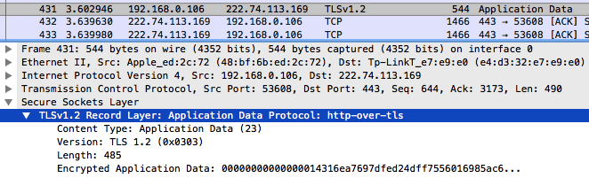

#TLS在HTTPS数据传输中的作用及其原理


##WHAT
**什么是TLS？SSL又是什么？**

   SSL(Secure Sockets Layer) 安全套接层，是一种安全协议，经历了 SSL 1.0、2.0、3.0 版本后发展成了标准安全协议 - TLS(Transport Layer Security) 传输层安全性协议。TLS 有 1.0 (1999年)、1.1(2006年)、1.2(2008年)、1.3(2018) 版本
   


##WHY
**为什么要用TLS？**

- HTTP缺点
   
   - 通信明文传输 （拆包后进行进制转换就可以获取明文，从而窃听数据）
   - 不验证通信身份（伪装客户端 or 服务端）
   - 无法确定报文完整性（传输过程被篡改）   

##HOW
**什么是对称加密、非对称加密？应用在什么环节？**


1. 使用非对称加密进行握手，并在该环节生产协商密钥。
2. 握手完成后使用协商密钥 双方进行加密解密校验。
3. 校验完成即握手完毕。
4. 使用对称加密生成的协商密钥对数据包进行加密传输。

**TLS握手过程**


1. **ClientHello 客户端发送申请建立连接的请求**
   
   - Version: 协议版本（protocol version）指示客户端支持的最佳协议版本
   - Random: 一个 32 字节数据，28 字节是随机生成的 (图中的 Random Bytes)；剩余的 4 字节包含额外的信息，与客户端时钟有关 (图中使用的是 GMT Unix Time)。在握手时，客户端和服务器都会提供随机数，客户端的暂记作 random_C (用于后续的密钥的生成)。这种随机性对每次握手都是独一无二的，在身份验证中起着举足轻重的作用。它可以防止 重放攻击，并确认初始数据交换的完整性。
   - Session ID: 在第一次连接时，会话 ID（session ID）字段是空的，这表示客户端并不希望恢复某个已存在的会话。典型的会话 ID 包含 32 字节随机生成的数据，一般由服务端生成通过 ServerHello 返回给客户端。
   - Cipher Suites: 密码套件（cipher suite）块是由客户端支持的所有密码套件组成的列表，该列表是按优先级顺序排列的，例如
      - TLS\_ECDHE\_ECDSA\_WITH\_AES\_128\_GCM\_SHA256
      - TLS 协议
      - ECDHE 密钥交换协议
      - ECDSA 身份认证算法
      - AES\_128\_GCM 对称加密算法
      - SHA256 MAC
   - Compression: 客户端可以提交一个或多个支持压缩的方法。默认的压缩方法是 null，代表没有压缩
   - Extensions: 扩展（extension）块由任意数量的扩展组成。这些扩展会携带额外数据


2. **ServerHello 服务响应**
   
   
   - 这个消息的结构与 ClientHello 类似，只是每个字段只包含一个选项，其中包含服务端的 random_S 参数 (用于后续的密钥协商)。服务器无需支持客户端支持的最佳版本。如果服务器不支持与客户端相同的版本，可以提供某个其他版本以期待客户端能够接受
   - 图中的 Cipher Suite 是后续密钥协商和身份验证要用的加密套件，此处选择的密钥交换与签名算法是 ECDHE_RSA，对称加密算法是 AES-GCM，后面会讲到这个
   - 还有一点默认情况下 TLS 压缩都是关闭的，因为 CRIME 攻击会利用 TLS 压缩恢复加密认证 cookie，实现会话劫持，而且一般配置 gzip 等内容压缩后再压缩 TLS 分片效益不大又额外占用资源，所以一般都关闭 TLS 压缩

3. **Certificate**
   - 典型的 Certificate 消息用于携带服务器 X\.509 
   - 证书链。服务器必须保证它发送的证书与选择的算法套件一致。比方说，公钥算法与套件中使用的必须匹配。除此以外，一些密钥交换算法依赖嵌入证书的特定数据，而且要求证书必须以客户端支持的算法签名。所有这些都表明服务器需要配置多个证书（每个证书可能会配备不同的证书链）。
   
   - Certificate 消息是可选的，因为并非所有套件都使用身份验证，也并非所有身份验证方法都需要证书。更进一步说，虽然消息默认使用 X.509 证书，但是也可以携带其他形式的标志；一些套件就依赖 PGP 密钥.

4. **ServerKeyExchange**
   - 携带密钥交换需要的额外数据。ServerKeyExchange 是可选的，消息内容对于不同的协商算法套件会存在差异。部分场景下，比如使用 RSA 算法时，服务器不需要发送此消息。
   - ServerKeyExchange 仅在服务器证书消息（也就是上述 Certificate 消息）不包含足够的数据以允许客户端交换预主密钥（premaster secret）时才由服务器发送。
   - 比如基于 DH 算法的握手过程中，需要单独发送一条 ServerKeyExchange 消息带上 DH 参数:
   

5. **ServerHelloDone**
   - 表明服务器已经将所有预计的握手消息发送完毕。在此之后，服务器会等待客户端发送消息。
6. **verify certificate**
   - 客户端验证证书的合法性，如果验证通过才会进行后续通信，否则根据错误情况不同做出提示和操作，合法性验证内容包括如下:
      - 证书链的可信性 trusted certificate path;
      - 证书是否吊销 revocation，有两类方式 - 离线 CRL 与在线 OCSP，不同的客户端行为会不同;
      - 有效期 expiry date，证书是否在有效时间范围;
      - 域名 domain，核查证书域名是否与当前的访问域名匹配;
   - 由 PKI 体系 的内容可知，对端发来的证书签名是 CA 私钥加密的，接收到证书后，先读取证书中的相关的明文信息，采用相同的散列函数计算得到信息摘要，然后利用对应 CA 的公钥解密签名数据，对比证书的信息摘要，如果一致，则可以确认证书的合法性；然后去查询证书的吊销情况等
7. **ClientKeyExchange**
   - 合法性验证通过之后，客户端计算产生随机数字的预主密钥（Pre-master），并用证书公钥加密，发送给服务器并携带客户端为密钥交换提供的所有信息。这个消息受协商的密码套件的影响，内容随着不同的协商密码套件而不同。
   - 此时客户端已经获取全部的计算协商密钥需要的信息: 两个明文随机数 random_C 和 random_S 与自己计算产生的 Pre-master，然后得到协商密钥(用于之后的消息加密)
   
   - ```enc_key = PRF(Pre_master, "master secret", random_C + random_S)```
   
   - 

   - 图中使用的是 ECDHE 算法，ClientKeyExchange 传递的是 DH 算法的客户端参数，如果使用的是 RSA 算法则此处应该传递加密的预主密钥
   
8. **ChangeCipherSpec**

  通知服务器后续的通信都采用协商的通信密钥和加密算法进行加密通信

   >注意 ChangeCipherSpec 不属于握手消息，它是另一种协议，只有一条消息，作为它的子协议进行实现。

9. **Finished (Encrypted Handshake Message)**

   Finished 消息意味着握手已经完成。消息内容将加密，以便双方可以安全地交换验证整个握手完整性所需的数据。
   
   这个消息包含 verify_data 字段，它的值是握手过程中所有消息的散列值。这些消息在连接两端都按照各自所见的顺序排列，并以协商得到的主密钥 (enc_key) 计算散列。这个过程是通过一个伪随机函数（pseudorandom function，[PRF](https://blog.csdn.net/mrpre/article/details/80056618)）来完成的，这个函数可以生成任意数量的伪随机数据。
两端的计算方法一致，但会使用不同的标签（finished_label）：客户端使用 client finished，而服务器则使用 server finished

   `verify_data = PRF(master_secret, finished_label, Hash(handshake_messages))`
   
   因为 Finished 消息是加密的，并且它们的完整性由协商 MAC 算法保证，所以主动网络攻击者不能改变握手消息并对 vertify_data 的值造假。在 TLS 1.2 版本中，Finished 消息的长度默认是 12 字节（96 位），并且允许密码套件使用更长的长度。在此之前的版本，除了 SSL 3 使用 36 字节的定长消息，其他版本都使用 12 字节的定长消息。

10. **Server**

   服务器用私钥解密加密的 Pre-master 数据，基于之前交换的两个明文随机数 random_C 和 random_S，同样计算得到协商密钥: `enc_key = PRF(Pre_master, "master secret", random_C + random_S);` 
   
   详见[PRF](https://blog.csdn.net/mrpre/article/details/80056618)
  
   同样计算之前所有收发信息的 hash 值，然后用协商密钥解密客户端发送的 verify_data_C，验证消息正确性;
   
11. **change\_cipher\_spec**

   
   服务端验证通过之后，服务器同样发送 change\_cipher\_spec 以告知客户端后续的通信都采用协商的密钥与算法进行加密通信（图中多了一步 New Session Ticket，此为会话票证，会在会话恢复中解释）;
   
12. **Finished (Encrypted Handshake Message)**
   服务器也结合所有当前的通信参数信息生成一段数据 (verify_data_S) 并采用协商密钥 session secret (enc_key) 与算法加密并发送到客户端;

13. **握手结束**
   客户端计算所有接收信息的 hash 值，并采用协商密钥解密 verify_data_S，验证服务器发送的数据和密钥，验证通过则握手完成;
14. **加密通信**

   开始使用协商密钥与算法进行加密通信。
   


## TLS 1.3延展


安全通道所使用的密码参数由 TLS 握手协议生成。这个 TLS 的子协议，握手协议在 Client 和 Server 第一次通信时使用。握手协议允许两端协商一个协议版本，选择密码算法，选择性互相认证，并建立共享的密钥数据。一旦握手完成，双方就会使用建立好的密钥保护应用层数据。
一个失败的握手或其它的协议错误会触发连接的中止，在这之前可以有选择地发送一个警报消息，遵循 Alert Protocol 协议。

TLS 1.3 支持 3 种基本密钥交换模式：

- (EC)DHE (基于有限域或椭圆曲线的 Diffie-Hellman)
- PSK - only
- PSK with (EC)DHE


```
          Client                                           Server

Key  ^ ClientHello
Exch | + key_share*
     | + signature_algorithms*
     | + psk_key_exchange_modes*
     v + pre_shared_key*       -------->
                                                  ServerHello  ^ Key
                                                 + key_share*  | Exch
                                            + pre_shared_key*  v
                                        {EncryptedExtensions}  ^  Server
                                        {CertificateRequest*}  v  Params
                                               {Certificate*}  ^
                                         {CertificateVerify*}  | Auth
                                                   {Finished}  v
                               <--------  [Application Data*]
     ^ {Certificate*}
Auth | {CertificateVerify*}
     v {Finished}              -------->
       [Application Data]      <------->  [Application Data]


```
- \+  表示的是在以前标注的消息中发送的值得注意的扩展
- \*  表示可选的或者依赖一定条件的消息/扩展，它们不总是发送
- () 表示消息由从 Client\_early\_traffic\_secret 导出的密钥保护
- {} 表示消息使用从一个 [sender]\_handshake\_traffic\_secret 导出的密钥保护
- [] 表示消息使用从 [sender]\_application\_traffic\_secret\_N 导出的密钥保护

握手可以被认为有三个阶段：

- 密钥交换：建立共享密钥数据并选择密码参数。在这个阶段之后所有的数据都会被加密。
- Server 参数：建立其它的握手参数（Client 是否被认证，应用层协议支持等）。
- 认证：认证 Server（并且选择性认证 Client），提供密钥确认和握手完整性。

在密钥交换阶段，Client 会发送 ClientHello 消息，其中包含了一个随机 nonce(ClientHello.random)；它提供了协议版本，一个对称密码/HKDF hash 对的列表；一个 Diffie-Hellman 密钥共享集合或一个预共享密钥标签（在 "key_share" 扩展中）集合，或二者都有；和可能的其它扩展。

Server 处理 ClientHello 并为连接确定合适的密码参数。然后它会以自己的 ServerHello 作为响应，其中表明了协商好的连接参数。ClientHello 和 ServerHello 合在一起来确定共享密钥。如果已经建立的 (EC)DHE 密钥正在被使用，则 ServerHello 中会包含一个 ”key_share” 扩展，和这个扩展一起的还有 Server 的临时 Diffie-Hellman 共享参数，这个共享参数必须与 Client 的一个共享参数在相同的组里。如果使用的是 PSK 密钥，则 ServerHello 中会包含一个 "pre_shared_key" 扩展以表明 Client 提供的哪一个 PSK 被选中。需要注意的是实现上可以将 (EC)DHE 和 PSK 一起使用，这种情况下两种扩展都需要提供。

## 对 TLS 1.3 改进
TLS 1.3 规范中还定义了一些可选的针对 TLS 1.2 的实现，包括那些不支持 TLS 1.3 的实现。

- 节约了一个 RTT

- TLS 1.2 中通过 1 个 RTT 即可完成会话恢复，那么 TLS 1.3 是如何做到 0 RTT 连接的？
   - 当一个支持 TLS 1.3 的客户端连接到同样支持 TLS 1.3 的服务器时， 客户端会将收到服务器发送过来的 Ticket 通过相关计算，一起组成新的 预共享密钥，PSK （PreSharedKey）。客户端会将该 PSK 缓存在本地，在会话恢复时在 Client Hello 上带上 PSK 扩展，同时通过之前客户端发送的完成（finished）计算出恢复密钥 （Resumption Secret）通过该密钥加密数据发送给服务器。服务器会从会话 Ticket 中算出 PSK，使用它来解密刚才发过来的加密数据。至此完成了该 0-RTT 会话恢复的过程。

- 修补不安全因素
   - 明确禁止在记录协议里使用压缩；
   - 废除了 RC4、DES 对称加密算法；
   - 废除了 ECB、CBC 等传统分组模式；
   - 废除了 MD5、SHA1、SHA-224 摘要算法；
   - 废除了 RSA、DH 密钥交换算法和许多命名曲线。

TLS1.3 里只保留了 AES、ChaCha20 对称加密算法，分组模式只能用 AEAD 的 GCM、CCM 和 Poly1305，摘要算法只能用 SHA256、SHA384，密钥交换算法只有 ECDHE 和 DHE，椭圆曲线也被“砍”到只剩 P-256 和 x25519 等 5 种。


##参考文献

[SSL/TLS 详解](https://blog.wangriyu.wang/2018/03-http-tls.html)

[TLS详解](https://juejin.im/post/5b88a93df265da43231f1451)

[TLS 1.3 Introduction](https://juejin.im/post/5c5d611a6fb9a049a97a2995)

[七牛云概述 TLS 1.3](https://juejin.im/post/591941de128fe1005ccf8e1d)

[TLS PreMaster/Master Secret(Key)计算](https://www.linuxidc.com/Linux/2015-07/120230.htm)

[数字签名原理](https://www.jianshu.com/p/b5e376080977)
